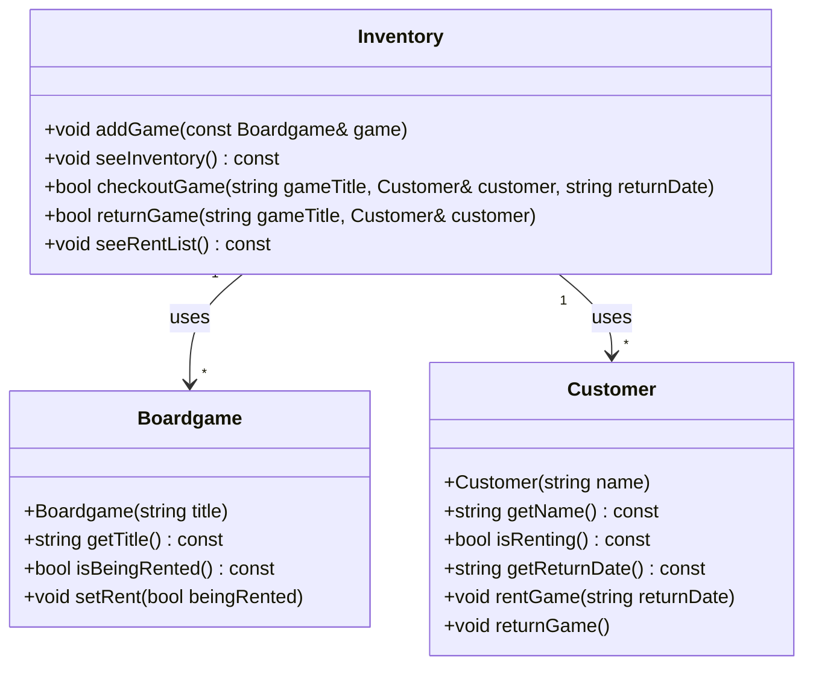

Step 1
- A program that tracks board games in use. The program needs to keep track 
of what is currently avaiable, checkout copies to customers, track which 
customers has what,and track when games are returned.

Step 2
- Nouns: Boardgame, Customer, Inventory, 
- Attributes:
	- boardgame: title, in use
	- customer: name, renting status, return date
	- invetory: add games, view games, checkout, return games, see rent list
- Verbs:
	- See inventory 
	- checkout
	- see rent list
	- return boardgame

Step 3

```
// boardgame.h
class Boardgame
{
public:
    Boardgame(const std::string& title);
    std::string getTitle() const;
    bool isBeingRented() const;
    void setRent(bool beingRented);
private:
    std::string title;
    bool beingRented;
};

// customer.h
class Customer
{
public:
    Customer(const std::string& name);
    std::string getName() const;
    bool isRenting() const;
    std::string getReturnDate() const;
    void rentGame(const std::string& returnDate);
    void returnGame();
private:
    std::string name;
    bool renting;
    std::string returnDate
};

// inventory.h
class Inventory
{
public:
    void addGame(const Boardgame& game);
    void seeInventory() const;
    bool checkoutGame(const std::string& gameTitle, Customer& customer, const std::string& returnDate);
    bool returnGame(const std::string& gameTitle, Customer& customer);
    void seeRentList() const;

private:
    std::vector<Boardgame> games_;
    std::vector<Customer> customers_;
};



